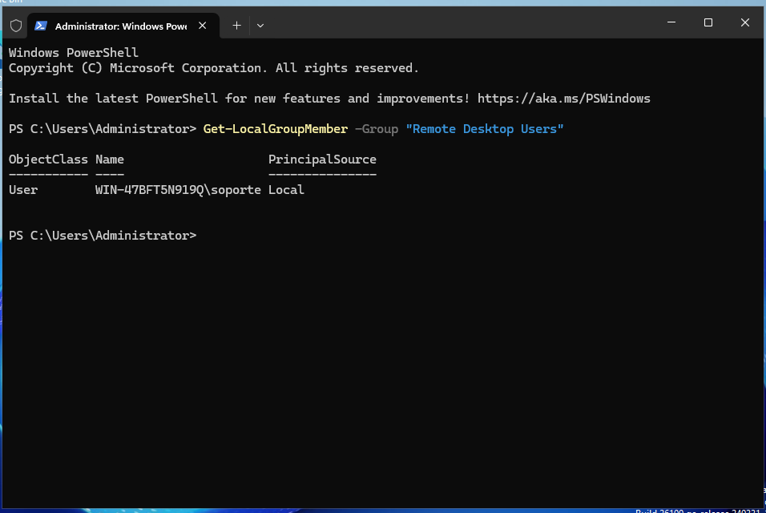
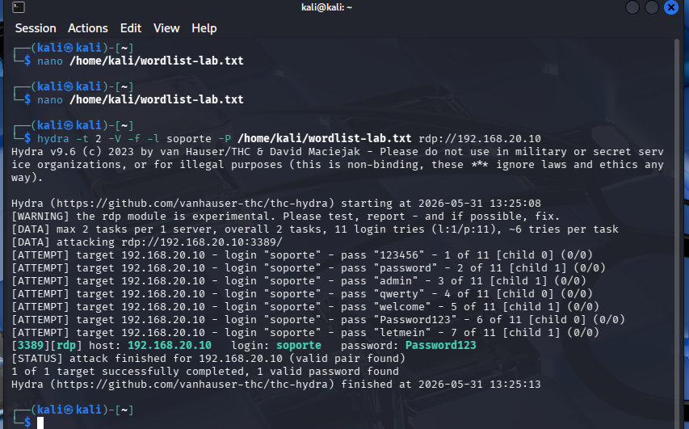
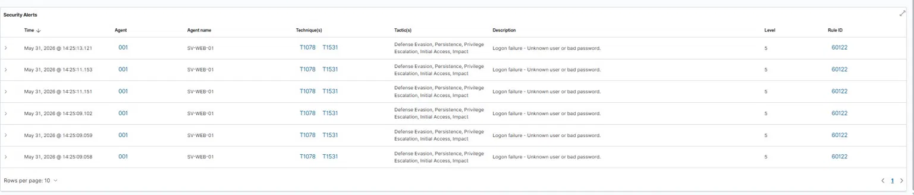
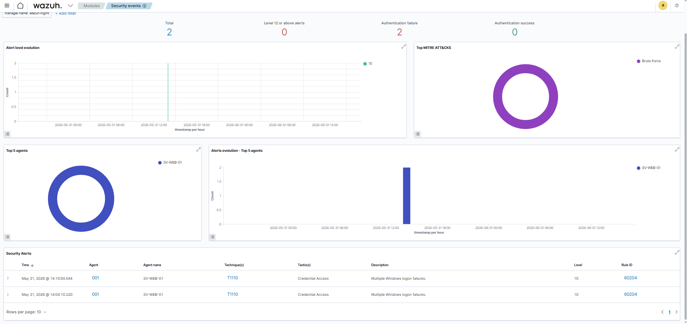
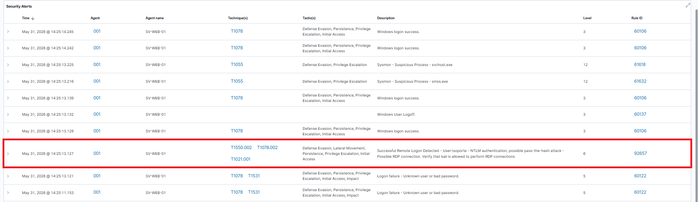
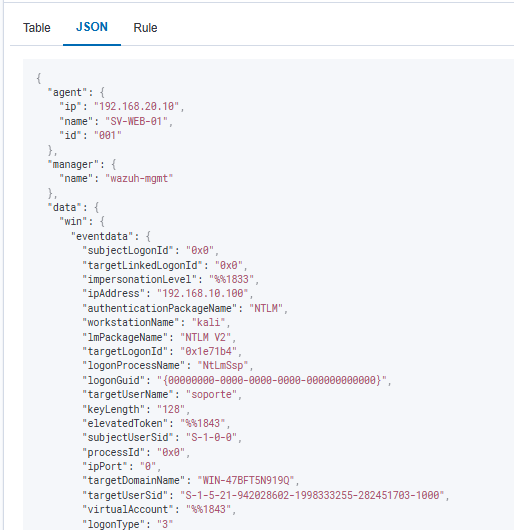

# Escenarios de Ataque — Home SOC Lab

Documentación de los escenarios de ataque ejecutados desde la zona ATK (Kali Linux) contra el endpoint en DMZ (Windows Server 2025) y su análisis desde el SIEM (Wazuh) en la zona MGMT.

**Objetivo:** validar la cadena de detección end-to-end del laboratorio, identificar gaps de visibilidad y demostrar análisis de incidentes en un entorno controlado.

---

## Topología 

```
   Kali (ATK)              Windows Server (DMZ)         Wazuh (MGMT)
  192.168.10.10  ────►       192.168.20.10        ──►   192.168.30.10
                        (Sysmon + agente Wazuh)         (SIEM)
```

Reglas de firewall relevantes:
- ATK → DMZ permitido en 80, 443, 3389.
- DMZ → MGMT permitido en 1514, 1515 (telemetría agente).
- ATK → MGMT bloqueado (el atacante no puede ver el SIEM).

---

## Brute Force RDP desde Kali

### Resumen ejecutivo

Ataque de fuerza bruta contra el servicio RDP del Windows Server usando Hydra con una wordlist controlada. **Resultado:** el ataque tuvo éxito en encontrar una credencial válida, y Wazuh detectó tanto el patrón de brute force como el logon exitoso posterior, 
mapeando todo a MITRE ATT&CK automáticamente. Se identifica además un gap secundario: la correlación automática entre brute force + logon exitoso del mismo usuario no existe en las reglas default y requiere una regla custom.

### Mapeo MITRE ATT&CK

| Técnica | Nombre | Táctica |
|---|---|---|
| T1110.001 | Brute Force: Password Guessing | Credential Access |
| T1021.001 | Remote Services: Remote Desktop Protocol | Lateral Movement |
| T1078 | Valid Accounts | Defense Evasion / Persistence / Privilege Escalation / Initial Access |

### Preparación del entorno

**1. Habilitación de RDP en Windows Server:**
- System Properties → Remote → "Allow remote connections to this computer".
- NLA deshabilitado deliberadamente para permitir que Hydra autentique (en producción NLA debe estar habilitado).

**2. Creación de usuario señuelo:**
Creamos un usuario de nombre windows mediante PowerShell de nombre "Soporte" y contraseña "Password123"

**3. Verificación de auditoría de logons:**
### Validación del usuario en grupo RDP


Confirmado: "Logon" con "Success and Failure" habilitado. Sin esto, los Event ID 4625 no se generarían y el ataque sería invisible.


### Ejecución del ataque
**Wordlist usada**:
```
123456
password
admin
qwerty
welcome
letmein
Password123    ← credencial real del usuario
admin123
P@ssw0rd
```

**Comando Hydra para el ataque:**
```bash
hydra -t 2 -V -f -l soporte -P /home/kali/wordlist-lab.txt rdp://192.168.20.10
```

### Salida exitosa de Hydra



**Resultado:**
```
[3389][rdp] host: 192.168.20.10   login: soporte   password: Password123
[STATUS] attack finished for 192.168.20.10 (valid pair found)
1 of 1 target successfully completed, 1 valid password found
```

Hydra encontró la credencial en el intento 8 de 11.


### Análisis en Wazuh

#### Fase 1: detección del brute force

Cascada de alertas individuales y una alerta agregada por correlación.

**Alertas individuales — Rule 60122 (nivel 5):**
- Descripción: *"Logon failure - Unknown user or bad password"*
- Cada una corresponde a un Event ID 4625 de Windows.
- Mapean a T1078 y T1531.

### cascada de logons fallidos
> 


**Alerta agregada — Rule 60204 (nivel 10):**
- Descripción: *"Multiple Windows logon failures"*
- Mapeo MITRE: **T1110 — Brute Force**.
- Táctica: Credential Access.

Esta es la detección clave: Wazuh **correlaciona** múltiples fallos del mismo usuario en una ventana temporal corta y genera una alerta de alto nivel. Es la diferencia entre tener logs y tener un SIEM.

### Alerta de correlación nivel 10 


#### Fase 2: detección del logon exitoso

**Rule 92657 (nivel 6):**
- Descripción: *"Successful Remote Logon Detected - User:\soporte - NTLM authentication, possible pass-the-hash attack - Possible RDP connection. Verify that kali is allowed to perform RDP connections"*
- Mapeo MITRE: T1550.002, T1078.002, T1021.001.

Observaciones del analista:

1. Wazuh menciona "**possible pass-the-hash attack**" como una de varias hipótesis. **Esta hipótesis se descarta** en este caso: el evento previo de brute force exitoso (rule 60204) indica que el atacante usó credenciales obtenidas por fuerza bruta,
no un hash robado. En un incidente real, esta es la línea de razonamiento que el analista sigue para clasificar correctamente la técnica usada.
2. La alerta menciona literalmente el nombre de la máquina origen ("kali"), lo que muestra el nivel de enriquecimiento de los eventos Sysmon + Windows logs.


### detección del logon exitoso



#### Fase 3: análisis del evento crudo

Expansión del evento en Wazuh para verificar los campos relevantes:

| Campo | Valor | Significado |
|---|---|---|
| `data.win.eventdata.ipAddress` | 192.168.10.10 | IP origen del logon (Kali) |
| `data.win.eventdata.workstationName` | kali | Hostname origen |
| `data.win.eventdata.targetUserName` | soporte | Usuario comprometido |
| `data.win.eventdata.logonType` | 10 | RemoteInteractive (RDP) |
| `data.win.eventdata.authenticationPackageName` | NTLM | Protocolo de autenticación |

`logonType: 10` confirma que el acceso fue por RDP. NTLM como package name es esperable en logons locales sin Active Directory.

### detalle del evento crudo



#### Vista panorámica MITRE

> 📸 **Captura 09:** dashboard MITRE ATT&CK (`09-wazuh-mitre-dashboard.png`)

### Reconstrucción de la kill chain

| Fase | Técnica MITRE | Evidencia | Nivel Wazuh |
|---|---|---|---|
| 1. Brute force attempt | T1110.001 | Cascada de Rule 60122 (Event ID 4625) | 5 (cada uno) |
| 2. Brute force detection | T1110 | Rule 60204 (agregada por correlación) | **10** |
| 3. Initial access exitoso | T1078, T1021.001 | Rule 92657 (Event ID 4624, logonType 10) | 6 |
| 4. Hipótesis descartada | T1550.002 (PtH) | Mencionada en rule 92657 | N/A |


---
**Autor:** Thomas  
**Fecha de ejecución:** 31 de mayo de 2026  
**Entorno:** Home SOC Lab v1 — pfSense 2.7.2 / Wazuh 4.7.5 / Windows Server 2025 / Kali 2024.x
